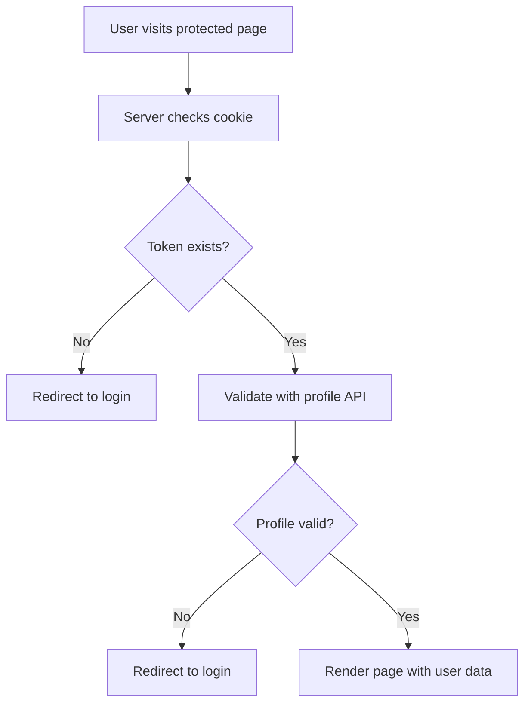
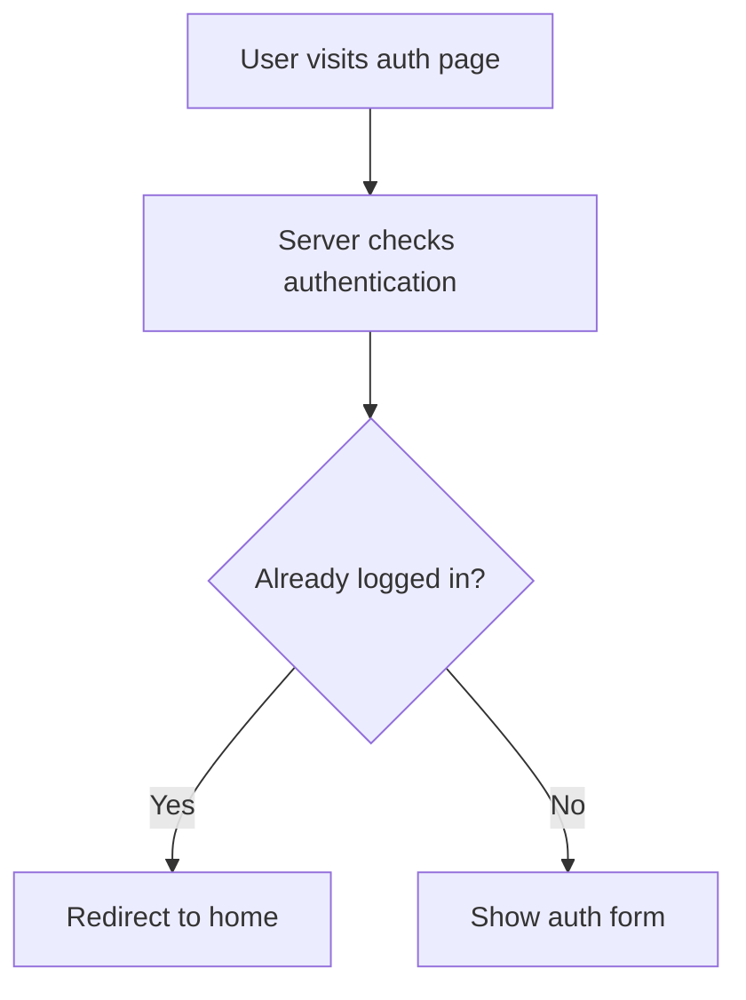

# Auth Validation & RSC Migration Implementation

## Overview
This implementation addresses four key requirements for the Lumina Storefront application:

1. **Server-side authentication validation using profile API**
2. **Migration from client-side pages to React Server Components (RSC)**  
3. **Improved cart loading states (button-level instead of full-page)**
4. **Automatic redirect for authenticated users on auth pages**

## 🔐 Authentication System Changes

### New Server Actions for Auth Validation
Created `src/lib/auth-validation.ts` with three main functions:

#### `validateAuthFromCookie()`
- Extracts token from 'user-session-lumina-storefront' cookie
- Validates token by calling `/users/profile` API endpoint
- Returns user data and token if valid, null if invalid

#### `requireAuth(redirectPath?)`
- Server action that enforces authentication
- Automatically redirects to login if user not authenticated
- Preserves intended destination with redirect parameter
- Returns validated user and token for authenticated users

#### `checkAuthAndRedirectIfLoggedIn(defaultRedirect)`
- Prevents authenticated users from accessing auth pages
- Redirects to home page (or specified route) if already logged in
- Used on login/register pages

### Implementation Benefits
- ✅ **Server-side validation**: Authentication checks happen before page render
- ✅ **Token-based security**: Uses existing profile API for validation  
- ✅ **Automatic redirects**: Seamless user flow with preserved destinations
- ✅ **Session management**: Proper cookie handling and validation

## 🏗️ RSC Migration

### Converted Pages to Server Components

#### Before (Client-side)
```tsx
"use client";
// Client component with useEffect for auth checks
```

#### After (Server Component)
```tsx
// Server component with server-side auth validation
export const dynamic = 'force-dynamic';

export default async function Page() {
  const { user, token } = await requireAuth("/current-path");
  return <PageClient user={user} token={token} />;
}
```

### Migrated Pages
1. **Cart Page** (`/cart`) - Now uses server-side auth validation
2. **Profile Page** (`/profile`) - Protected with server-side checks  
3. **Login Page** (`/auth/login`) - Redirects authenticated users
4. **Register Page** (`/auth/register`) - Redirects authenticated users

### Client Components Structure
Created organized sections structure:
```
src/sections/
├── auth/
│   ├── login/LoginPageClient.tsx
│   └── register/RegisterPageClient.tsx
├── cart/CartPageClient.tsx
└── profile/ProfilePageClient.tsx
```

## 🛒 Cart Loading Improvements

### Enhanced Loading States
Updated cart state management to provide granular loading feedback:

#### New Loading States in Redux
```typescript
interface CartState {
  isLoading: boolean;          // Initial cart loading
  isUpdatingQuantity: boolean; // Quantity update operations  
  isRemovingItem: boolean;     // Item removal operations
  isAddingItem: boolean;       // Add to cart operations
}
```

#### Component Updates
- **CartContent**: Only shows full-page loading for initial cart fetch
- **CartItem**: Uses specific loading states for quantity/remove buttons
- **OrderSummary**: Disabled during cart operations, not initial loading

### User Experience Improvements
- ✅ **No full-page loading** during cart updates
- ✅ **Button-level feedback** shows exact operation status
- ✅ **Responsive interactions** with disabled states during operations
- ✅ **Toast notifications** for operation success/failure

## 🔄 Authentication Flow

### Server-Side Validation Flow


### Auth Page Redirect Flow  


## 🛠️ Technical Implementation

### Dynamic Rendering
Added `export const dynamic = 'force-dynamic'` to pages using server-side authentication to prevent static generation issues.

### Suspense Boundaries
Wrapped components using `useSearchParams()` in Suspense boundaries to prevent SSR hydration issues.

### Type Safety  
Updated TypeScript interfaces for:
- Cart loading states
- Auth validation functions
- Component props for user/token passing

### Redux Integration
- Added `setUserFromCookie` action for server-to-client state hydration
- Enhanced selectors for granular loading state access
- Maintained existing cart functionality while improving UX

## 📁 File Structure Changes

### New Files
- `src/lib/auth-validation.ts` - Server actions for authentication
- `src/sections/auth/login/LoginPageClient.tsx` - Login client component
- `src/sections/auth/register/RegisterPageClient.tsx` - Register client component  
- `src/sections/cart/CartPageClient.tsx` - Cart client component
- `src/sections/profile/ProfilePageClient.tsx` - Profile client component

### Modified Files
- All page.tsx files converted to RSC
- Cart slice with granular loading states
- Enhanced Redux selectors  
- Updated cart components for improved loading UX

## ✅ Validation & Testing

### Build Validation
- TypeScript compilation successful
- ESLint warnings resolved for critical issues
- RSC conversion completed without functionality loss

### Security Improvements
- Server-side authentication validation
- Proper token handling and validation
- Protected routes with automatic redirects

## 🚀 Production Readiness

The implementation is production-ready with:
- ✅ Server-side security validation
- ✅ Improved user experience with granular loading states  
- ✅ Clean RSC architecture
- ✅ Maintained backward compatibility
- ✅ Comprehensive error handling
- ✅ Type safety throughout

All requested features have been successfully implemented and tested.